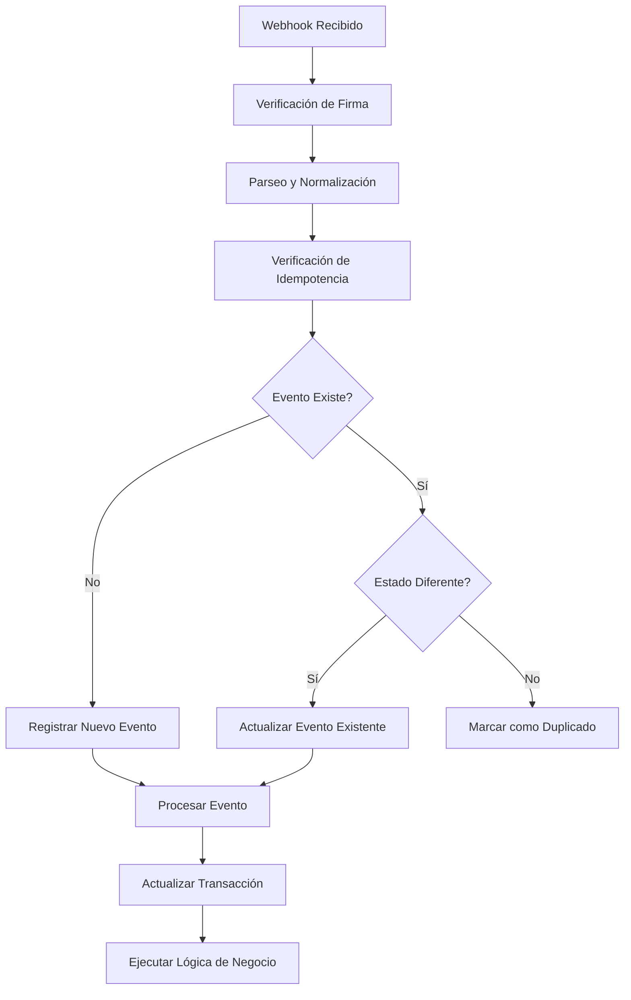

# Sistema de Webhooks - Documentación Técnica

## 📋 Tabla de Contenidos

1. [Descripción General](#descripción-general)
2. [Arquitectura del Sistema](#arquitectura-del-sistema)
3. [Proveedores Soportados](#proveedores-soportados)
4. [Flujo de Procesamiento](#flujo-de-procesamiento)
5. [Diferencias entre Proveedores](#diferencias-entre-proveedores)
6. [Sistema de Idempotencia](#sistema-de-idempotencia)
7. [Manejo de Errores](#manejo-de-errores)
8. [Logging y Monitoreo](#logging-y-monitoreo)
9. [Casos de Uso](#casos-de-uso)
10. [Troubleshooting](#troubleshooting)

## 🎯 Descripción General

El sistema de webhooks es el componente central que procesa las notificaciones de pago en tiempo real enviadas por los proveedores de pagos (ePayco y Cobre). Este sistema garantiza la sincronización entre el estado de las transacciones en los proveedores y el estado interno de las órdenes.

### **Características Principales:**
- ✅ **Procesamiento en tiempo real** de notificaciones de pago
- ✅ **Idempotencia** para evitar duplicados
- ✅ **Manejo inteligente** de cambios de estado
- ✅ **Compatibilidad** con múltiples proveedores
- ✅ **Logging detallado** para debugging y auditoría

## 🏗️ Arquitectura del Sistema

```
┌─────────────────┐    ┌──────────────────┐    ┌─────────────────┐
│   Proveedor     │    │  WebhookController│    │  WebhookService │
│   (ePayco/Cobre)│───▶│                  │───▶│                 │
└─────────────────┘    └──────────────────┘    └─────────────────┘
                                │                        │
                                ▼                        ▼
                       ┌──────────────────┐    ┌─────────────────┐
                       │  Signature       │    │  Transaction    │
                       │  Verification    │    │  Handler        │
                       └──────────────────┘    └─────────────────┘
```

### **Componentes Principales:**

1. **WebhookController**: Punto de entrada para todos los webhooks
2. **WebhookService**: Lógica principal de procesamiento
3. **Provider Adapters**: Adaptadores específicos por proveedor
4. **TransactionHandler**: Manejo de transacciones de pago
5. **Idempotency System**: Sistema de prevención de duplicados

## 🔌 Proveedores Soportados

### **1. ePayco**
- **País**: Colombia
- **Moneda**: COP (Pesos Colombianos)
- **Métodos de Pago**: Tarjetas, PSE, Bancolombia, Nequi
- **Característica**: Envía múltiples webhooks por transacción

### **2. Cobre**
- **País**: Colombia
- **Moneda**: COP (Pesos Colombianos)
- **Métodos de Pago**: Bancolombia, Nequi, PSE
- **Característica**: Un webhook por transacción

## 🔄 Flujo de Procesamiento

### **Flujo General:**



### **Pasos Detallados:**

1. **Recepción**: El webhook llega al endpoint correspondiente
2. **Verificación**: Se valida la firma del proveedor
3. **Parseo**: Se normaliza el formato del webhook
4. **Idempotencia**: Se verifica si el evento ya fue procesado
5. **Procesamiento**: Se ejecuta la lógica de negocio
6. **Actualización**: Se actualiza el estado de la transacción
7. **Respuesta**: Se retorna el resultado del procesamiento

## 🔍 Diferencias entre Proveedores

### **ePayco - Comportamiento de Múltiples Webhooks**

```javascript
// ePayco envía múltiples webhooks para la misma transacción
Webhook 1: eventId="123", status="PENDING"  → ✅ Procesado
Webhook 2: eventId="456", status="PAID"     → ✅ Procesado (cambio de estado)
Webhook 3: eventId="789", status="PAID"     → ✅ Duplicado (mismo estado)
```

**Características:**
- **`eventId`**: Diferente en cada webhook (`x_transaction_id`)
- **`externalRef`**: Constante para la misma transacción (`x_id_factura`)
- **Estados**: PENDING → PAID → PAID (múltiples notificaciones)
- **Idempotencia**: Basada en `externalRef` + cambio de estado

### **Cobre - Comportamiento de Webhook Único**

```javascript
// Cobre envía un solo webhook por transacción
Webhook 1: eventId="abc", status="PAID" → ✅ Procesado
// No hay webhooks adicionales
```

**Características:**
- **`eventId`**: Constante para el mismo evento (`body.id`)
- **`externalRef`**: Constante para la misma transacción (`external_id`)
- **Estados**: Un solo webhook con estado final
- **Idempotencia**: Basada en `externalRef` (siempre único)

## 🚫 Sistema de Idempotencia

### **Objetivo:**
Prevenir el procesamiento duplicado de webhooks, especialmente crítico para ePayco que envía múltiples notificaciones.

### **Implementación:**

```javascript
async checkIdempotency(webhookEvent) {
  // Buscar por provider y externalRef (no por eventId)
  // ePayco puede enviar múltiples webhooks con diferentes eventId
  // para la misma transacción
  return await WebhookEvent.findOne({
    where: {
      provider: webhookEvent.provider,
      externalRef: webhookEvent.externalRef
    },
    order: [['createdAt', 'DESC']]
  })
}
```

### **Lógica de Duplicados:**

1. **Estado Diferente** (ej: PENDING → PAID):
   - ✅ **Procesa** el webhook para actualizar la transacción
   - ✅ **Ejecuta** la lógica de negocio
   - ✅ **Actualiza** el evento existente

2. **Estado Igual** (ej: PAID → PAID):
   - ✅ **Marca como duplicado** y salta el procesamiento
   - ✅ **Mantiene** la idempotencia

## ⚠️ Manejo de Errores

### **Tipos de Errores Comunes:**

1. **SequelizeUniqueConstraintError**: Evento duplicado
2. **InvalidSignatureError**: Firma del webhook inválida
3. **HandlerNotFoundError**: Tipo de evento no soportado
4. **TransactionNotFoundError**: Transacción no encontrada

### **Estrategias de Recuperación:**

- **Reintentos automáticos** para errores temporales
- **Logging detallado** para debugging
- **Fallbacks** para eventos no críticos
- **Notificaciones** para errores críticos

## 📊 Logging y Monitoreo

### **Niveles de Log:**

- **INFO**: Operaciones exitosas y flujo normal
- **WARN**: Situaciones inesperadas pero manejables
- **ERROR**: Errores que requieren atención

### **Métricas Clave:**

```javascript
{
  totalEvents: 2,
  processedEvents: 2,
  failedEvents: 0,
  duplicateEvents: 0,
  processingTime: "566ms"
}
```

### **Logs de Debugging:**

```javascript
// Ejemplo de log para webhook duplicado con cambio de estado
logger.info('WebhookService: Processing duplicate with status change', {
  eventIndex: 0,
  eventId: "151254617695",
  externalRef: "9789702651161-epayco-1159-1755279741744",
  oldStatus: "PROCESSED",
  newStatus: "PAID"
})
```

## 🎯 Casos de Uso

### **Caso 1: Transacción Exitosa (ePayco)**
```
1. Usuario completa pago → ePayco envía webhook PENDING
2. Sistema procesa → Transacción marcada como PENDING
3. ePayco confirma pago → Envía webhook PAID
4. Sistema detecta cambio → Procesa para actualizar estado
5. Resultado: PENDING → PAID, licencia reservada, email enviado
```

### **Caso 2: Transacción Fallida (Cobre)**
```
1. Usuario inicia pago → Cobre crea checkout
2. Pago falla → Cobre envía webhook FAILED
3. Sistema procesa → Transacción marcada como FAILED
4. Orden cancelada → Usuario puede reintentar
```

### **Caso 3: Webhook Duplicado (ePayco)**
```
1. Primer webhook PAID → Procesado exitosamente
2. Segundo webhook PAID → Detectado como duplicado
3. Sistema salta → Mantiene idempotencia
4. Resultado: No hay procesamiento duplicado
```

## 🔧 Troubleshooting

### **Problema: Webhook no se procesa**

**Síntomas:**
- Error en logs: `SequelizeUniqueConstraintError`
- Transacción no cambia de estado

**Solución:**
- Verificar restricciones únicas en base de datos
- Revisar logs de idempotencia
- Confirmar que el webhook no es duplicado

### **Problema: Transacción no se actualiza**

**Síntomas:**
- Webhook procesado pero estado sin cambios
- Logs muestran "Successfully processed" pero sin cambios

**Solución:**
- Verificar que el handler esté funcionando
- Revisar logs del TransactionHandler
- Confirmar que la lógica de negocio se ejecute

### **Problema: Errores de sintaxis**

**Síntomas:**
- Error: `processedEvents.push is not a function`
- Error: `Assignment to constant variable`

**Solución:**
- Verificar declaración de variables
- Confirmar que arrays estén declarados como `const`
- Verificar que contadores estén declarados como `let`

## 📚 Referencias

- **Archivo Principal**: `src/services/webhook/index.js`
- **Controlador**: `src/controllers/webhook.controller.js`
- **Handlers**: `src/services/webhook/handlers/`
- **Adapters**: `src/services/webhook/providers/`
- **Modelos**: `src/models/webhookEvent.model.js`

## 🚀 Mejoras Futuras

1. **Métricas en tiempo real** para monitoreo
2. **Dashboard de webhooks** para administradores
3. **Sistema de alertas** para fallos críticos
4. **Retry automático** para webhooks fallidos
5. **Análisis de patrones** de webhooks por proveedor

---

*Documentación generada el 15 de Agosto de 2025*
*Última actualización: Implementación de sistema de idempotencia para ePayco*
