# Diagrama de Flujo de Webhooks - Detallado

## 🔄 Flujo Completo del Sistema de Webhooks

### **Diagrama de Secuencia Principal:**

```mermaid
sequenceDiagram
    participant P as Proveedor<br/>(ePayco/Cobre)
    participant WC as WebhookController
    participant WS as WebhookService
    participant PA as ProviderAdapter
    participant TH as TransactionHandler
    participant DB as Base de Datos
    participant ES as EmailService

    P->>WC: Webhook POST
    Note over WC: Verificación de firma
    WC->>WS: processWebhook()
    
    WS->>PA: parseWebhook()
    PA-->>WS: Eventos normalizados
    
    loop Para cada evento
        WS->>WS: checkIdempotency()
        alt Evento ya existe
            alt Estado diferente
                WS->>DB: updateWebhookEvent()
                WS->>TH: handle()
                TH->>DB: Actualizar transacción
                TH->>ES: Enviar email
                WS->>DB: updateWebhookEvent(resultado)
            else Estado igual
                WS->>WS: Marcar como duplicado
            end
        else Evento nuevo
            WS->>DB: registerWebhookEvent()
            WS->>TH: handle()
            TH->>DB: Actualizar transacción
            TH->>ES: Enviar email
            WS->>DB: updateWebhookEvent(resultado)
        end
    end
    
    WS-->>WC: Resultado del procesamiento
    WC-->>P: Respuesta HTTP
```



### **Diagrama de Estados de Transacción:**


### **Diagrama de Flujo de Idempotencia:**

```mermaid
flowchart TD
    A[Webhook Recibido] --> B{Evento Existe?}
    
    B -->|No| C[Registrar Nuevo Evento]
    C --> D[Procesar Evento]
    D --> E[Actualizar Transacción]
    
    B -->|Sí| F{Estado Diferente?}
    
    F -->|No| G[Marcar como Duplicado]
    G --> H[Saltar Procesamiento]
    
    F -->|Sí| I[Actualizar Evento Existente]
    I --> J[Procesar Cambio de Estado]
    J --> E
    
    E --> K[Ejecutar Lógica de Negocio]
    K --> L[Registrar Resultado]
    L --> M[Respuesta al Proveedor]
```



## 🔍 Diferencias de Flujo por Proveedor

### **ePayco - Flujo Complejo:**

```mermaid
graph TD
    A[Usuario Paga] --> B[ePayco: Webhook PENDING]
    B --> C[Sistema: Procesa PENDING]
    C --> D[Transacción: PENDING]
    
    D --> E[ePayco: Webhook PAID]
    E --> F{Sistema: ¿Ya existe?}
    F -->|Sí| G{¿Estado diferente?}
    F -->|No| H[Procesar normalmente]
    
    G -->|Sí| I[Actualizar y procesar]
    G -->|No| J[Marcar duplicado]
    
    I --> K[Transacción: PAID]
    K --> L[Licencia reservada]
    L --> M[Email enviado]
    
    H --> K
    J --> N[Saltar procesamiento]
```



### **Cobre - Flujo Simple:**

```mermaid
graph TD
    A[Usuario Paga] --> B[Cobre: Webhook PAID/FAILED]
    B --> C[Sistema: Procesa webhook]
    C --> D{¿Transacción encontrada?}
    
    D -->|Sí| E[Actualizar estado]
    D -->|No| F[Ignorar evento interno]
    
    E --> G{Estado: PAID?}
    G -->|Sí| H[Licencia reservada]
    G -->|No| I[Orden cancelada]
    
    H --> J[Email enviado]
    J --> K[Transacción completada]
    
    F --> L[Evento ignorado]
```



## 📊 Estructura de Datos

### **WebhookEvent Model:**

```javascript
{
  id: "UUID",
  provider: "epayco|cobre",
  type: "payment|balance_credit",
  externalRef: "9789702651161-epayco-1183-1755286691440",
  eventId: "3018020471755280488",
  status: "PENDING|PAID|FAILED",
  amount: 8200000,
  currency: "COP",
  rawHeaders: "{}",
  rawBody: "{}",
  payload: "{}",
  processedAt: "2025-08-15T19:41:22.311Z",
  errorMessage: null,
  createdAt: "2025-08-15T19:41:22.311Z",
  updatedAt: "2025-08-15T19:41:22.311Z"
}
```

### **Flujo de Datos:**


## ⚡ Performance y Métricas

### **Tiempos de Procesamiento Típicos:**

- **ePayco**: 40-60ms por webhook
- **Cobre**: 20-30ms por webhook
- **Eventos duplicados**: 5-10ms (solo verificación)

### **Métricas de Rendimiento:**

```javascript
{
  // Webhook exitoso
  processingTime: "42ms",
  totalEvents: 1,
  processedEvents: 1,
  failedEvents: 0,
  duplicateEvents: 0,
  
  // Webhook con cambio de estado
  processingTime: "566ms",
  totalEvents: 1,
  processedEvents: 1,
  failedEvents: 0,
  duplicateEvents: 0
}
```

## 🚨 Puntos de Fallo y Recuperación

### **Puntos Críticos:**

1. **Verificación de Firma**: Si falla, webhook rechazado
2. **Base de Datos**: Si falla, evento perdido
3. **TransactionHandler**: Si falla, transacción no actualizada
4. **EmailService**: Si falla, usuario no recibe notificación

### **Estrategias de Recuperación:**

```mermaid
graph TD
    A[Fallo en Procesamiento] --> B{¿Error Crítico?}
    
    B -->|Sí| C[Log Error + Notificar]
    B -->|No| D[Retry Automático]
    
    C --> E[Manual Intervention]
    D --> F{¿Retry Exitoso?}
    
    F -->|Sí| G[Continuar Normal]
    F -->|No| C
    
    E --> H[Procesar Manualmente]
    H --> I[Verificar Estado]
    I --> G
```



## 🔧 Configuración y Variables de Entorno

### **Variables Requeridas:**

```bash
# ePayco
EPAYCO_P_CUST_ID_CLIENTE=your_cust_id
EPAYCO_P_KEY=your_key
EPAYCO_PUBLIC_KEY=your_public_key

# Cobre
COBRE_API_KEY=your_api_key
COBRE_WEBHOOK_SECRET=your_webhook_secret

# General
NODE_ENV=production
SCHEMA_ALTER=false
```

### **Endpoints de Webhook:**

- **ePayco**: `/api/webhooks/epayco`
- **Cobre**: `/api/webhooks/cobre`

---

*Diagrama generado el 15 de Agosto de 2025*
*Complementa la documentación principal en WEBHOOKS.md*
