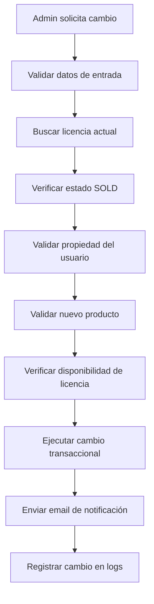

# Sistema de Cambio de Licencias

## Descripción General

El sistema de cambio de licencias permite a los administradores cambiar la licencia de un usuario que se equivocó en su compra, validando que la licencia pertenece al usuario y cambiando el producto en la orden correspondiente.

## Características Principales

- ✅ **Validación de Propiedad**: Verifica que la licencia pertenece al usuario mediante número de documento
- ✅ **Validación de Precios**: Solo permite cambios entre productos del mismo precio
- ✅ **Transaccional**: Todas las operaciones son atómicas usando transacciones de base de datos
- ✅ **Notificación Automática**: Envía email al usuario informando del cambio
- ✅ **Auditoría Completa**: Registra todos los cambios en el sistema de logs
- ✅ **Seguridad**: Solo accesible por administradores con rol `SUPER_ADMIN`

## Flujo de Cambio de Licencia



## Endpoint de API

### Cambiar Licencia

```http
POST /api/license-change/change
Content-Type: application/json
Authorization: Bearer {admin_token}

{
  "licenseKey": "AAA-BBB-CCC-111",
  "customerDocumentNumber": "12345678",
  "newProductRef": "SOFT-PRO-2Y"
}
```

**Parámetros:**
- `licenseKey` (string, requerido): Clave de la licencia actual
- `customerDocumentNumber` (string, requerido): Número de documento del cliente
- `newProductRef` (string, requerido): Referencia del nuevo producto

**Respuesta Exitosa (200):**
```json
{
  "success": true,
  "message": "Licencia cambiada exitosamente",
  "data": {
    "changeInfo": {
      "changedAt": "2025-01-14T10:30:00.000Z",
      "oldProductName": "Software Pro 1 Año",
      "newProductName": "Software Pro 2 Años"
    },
    "customer": {
      "id": 1,
      "name": "Juan Pérez",
      "email": "juan@example.com"
    },
    "order": {
      "id": 123,
      "productRef": "SOFT-PRO-2Y"
    },
    "licenses": {
      "old": {
        "licenseKey": "AAA-BBB-CCC-111",
        "productRef": "SOFT-PRO-1Y",
        "status": "AVAILABLE"
      },
      "new": {
        "licenseKey": "DDD-EEE-FFF-222",
        "productRef": "SOFT-PRO-2Y",
        "status": "SOLD"
      }
    }
  }
}
```

**Errores Comunes:**

| Código | Error | Descripción |
|--------|-------|-------------|
| 400 | `licenseKey es requerido` | Falta la clave de licencia |
| 400 | `customerDocumentNumber es requerido` | Falta el número de documento |
| 400 | `newProductRef es requerido` | Falta la referencia del nuevo producto |
| 400 | `Formato de licenseKey inválido` | Formato incorrecto de la clave |
| 400 | `El número de documento debe ser numérico con 8-12 dígitos` | Formato de documento inválido |
| 404 | `Licencia no encontrada` | La licencia no existe |
| 404 | `El número de documento no coincide` | El documento no pertenece al propietario |
| 404 | `Producto con referencia XXX no encontrado` | El nuevo producto no existe |
| 400 | `Solo se pueden cambiar licencias que estén vendidas` | La licencia no está vendida |
| 400 | `Solo se pueden cambiar licencias de órdenes completadas` | La orden no está completada |
| 400 | `No hay licencias disponibles para el producto XXX` | No hay stock del nuevo producto |
| 400 | `Los precios no coinciden` | Los productos tienen precios diferentes |
| 400 | `No se puede cambiar a la misma referencia de producto` | Intento de cambio al mismo producto |
| 400 | `El producto actual XXX no existe` | El producto actual no existe en el sistema |

## Validaciones del Sistema

### 1. Validación de Licencia
- ✅ La licencia debe existir
- ✅ La licencia debe tener estado `SOLD`
- ✅ La licencia debe estar asociada a una orden

### 2. Validación de Usuario
- ✅ El número de documento debe coincidir con el propietario de la licencia
- ✅ El usuario debe existir en el sistema

### 3. Validación de Producto
- ✅ El nuevo producto debe existir
- ✅ El nuevo producto debe estar activo
- ✅ El nuevo producto debe soportar licencias (`license_type: true`)
- ✅ Debe haber licencias disponibles del nuevo producto

### 4. Validación de Orden
- ✅ La orden debe estar completada (`status: COMPLETED`)

### 5. Validación de Precios
- ✅ Los productos deben tener el mismo precio (configurable)
- ✅ El producto actual debe existir en el sistema
- ✅ No se permite cambiar al mismo producto

## Proceso Transaccional

### 1. Actualización de Orden
```sql
UPDATE orders 
SET product_ref = 'SOFT-PRO-2Y' 
WHERE id = 123
```

### 2. Asignación de Nueva Licencia
```sql
UPDATE licenses 
SET status = 'SOLD', order_id = 123, sold_at = NOW() 
WHERE id = 2
```

### 3. Liberación de Licencia Anterior
```sql
UPDATE licenses 
SET status = 'AVAILABLE', order_id = NULL, sold_at = NULL, reserved_at = NULL 
WHERE id = 1
```

### 4. Actualización de Información de Envío
```json
{
  "shippingInfo": {
    "licenseChange": {
      "changedAt": "2025-01-14T10:30:00.000Z",
      "oldLicenseKey": "AAA-BBB-CCC-111",
      "oldProductRef": "SOFT-PRO-1Y",
      "newLicenseKey": "DDD-EEE-FFF-222",
      "newProductRef": "SOFT-PRO-2Y",
      "customerDocumentNumber": "12345678",
      "adminId": 1,
      "emailPending": true,
      "emailSent": true,
      "emailSentAt": "2025-01-14T10:30:05.000Z",
      "emailMessageId": "msg_123456"
    }
  }
}
```

## Email de Notificación

### Plantilla: `license-change.hbs`

El sistema envía automáticamente un email al usuario con:

- ✅ Confirmación del cambio realizado
- ✅ Información del producto anterior
- ✅ Información del nuevo producto
- ✅ Nueva clave de activación
- ✅ Instrucciones específicas (si las hay)
- ✅ Advertencia sobre la desactivación de la licencia anterior

### Variables del Email:
- `customerName`: Nombre completo del cliente
- `oldProductName`: Nombre del producto anterior
- `newProductName`: Nombre del nuevo producto
- `oldLicenseKey`: Clave de la licencia anterior
- `newLicenseKey`: Clave de la nueva licencia
- `instructions`: Instrucciones de activación
- `orderId`: Número de orden
- `changeDate`: Fecha del cambio
- `supportEmail`: Email de soporte
- `whatsappLink`: Link de WhatsApp

## Logs y Auditoría

### Logs de Negocio
```javascript
// Inicio del cambio
logger.logBusiness('licenseChange:start', {
  licenseKey: 'AAA-BBB-CCC-111',
  customerDocumentNumber: '12345678',
  newProductRef: 'SOFT-PRO-2Y',
  adminId: 1
})

// Cambio exitoso
logger.logBusiness('licenseChange:success', {
  oldLicenseId: 1,
  newLicenseId: 2,
  orderId: 123,
  customerId: 1,
  oldProductRef: 'SOFT-PRO-1Y',
  newProductRef: 'SOFT-PRO-2Y',
  adminId: 1
})

// Email enviado
logger.logBusiness('licenseChange:emailSent', {
  orderId: 123,
  customerEmail: 'juan@example.com',
  messageId: 'msg_123456'
})
```

### Logs de Error
```javascript
logger.logError(error, {
  operation: 'changeLicense',
  licenseKey: 'AAA-BBB-CCC-111',
  customerDocumentNumber: '12345678',
  newProductRef: 'SOFT-PRO-2Y',
  adminId: 1
})
```

## Casos de Uso

### Caso 1: Cambio Exitoso
1. Usuario compra "Software Pro 1 Año" por error
2. Admin identifica la licencia y el usuario
3. Admin solicita cambio a "Software Pro 2 Años"
4. Sistema valida y ejecuta el cambio
5. Usuario recibe email con nueva licencia

### Caso 2: Validación de Propiedad
1. Usuario A intenta cambiar licencia de Usuario B
2. Sistema verifica número de documento
3. Sistema rechaza el cambio por no coincidir

### Caso 3: Sin Stock Disponible
1. Admin solicita cambio a producto sin licencias disponibles
2. Sistema verifica disponibilidad
3. Sistema rechaza el cambio

### Caso 4: Precios Diferentes
1. Admin intenta cambiar a producto con precio diferente
2. Sistema valida precios
3. Sistema rechaza el cambio

## Seguridad

### Roles Requeridos
- **SUPER_ADMIN**: Único rol con acceso al endpoint

### Validaciones de Seguridad
- ✅ Autenticación requerida
- ✅ Autorización por rol
- ✅ Validación de propiedad de licencia
- ✅ Transacciones atómicas
- ✅ Logs de auditoría completos

### Consideraciones
- Solo licencias `SOLD` pueden ser cambiadas
- Solo órdenes `COMPLETED` pueden ser modificadas
- Los cambios son irreversibles (requieren nuevo cambio)
- Se mantiene historial completo en `shippingInfo`

## Testing

### Tests Unitarios
```bash
npm test -- src/tests/unit/services/licenseChange.service.test.js
```

### Casos de Prueba Cubiertos
- ✅ Cambio exitoso
- ✅ Validación de licencia no encontrada
- ✅ Validación de estado de licencia
- ✅ Validación de propiedad de usuario
- ✅ Validación de producto no encontrado
- ✅ Validación de producto inactivo
- ✅ Validación de producto sin licencias
- ✅ Validación de precios diferentes
- ✅ Validación de stock insuficiente
- ✅ Validación de orden no completada
- ✅ Validación de formato de datos
- ✅ Validación de documento colombiano
- ✅ Validación de cambio al mismo producto
- ✅ Validación de producto actual inexistente

## Configuración

### Variables de Entorno
```bash
# No se requieren variables adicionales
# Usa la configuración existente del sistema
```

### Personalización
Para deshabilitar la validación de precios, modificar en `licenseChange.service.js`:
```javascript
// Comentar o eliminar esta validación
if (currentProduct && currentProduct.price !== newProduct.price) {
  throw new Error(`Los precios no coinciden...`)
}
```

## Monitoreo

### Métricas a Monitorear
- Número de cambios de licencia por día
- Tiempo promedio de procesamiento
- Tasa de éxito vs errores
- Emails enviados exitosamente

### Alertas Recomendadas
- Errores frecuentes de validación
- Fallos en envío de emails
- Tiempo de respuesta alto
- Cambios de licencia fuera de horario normal 