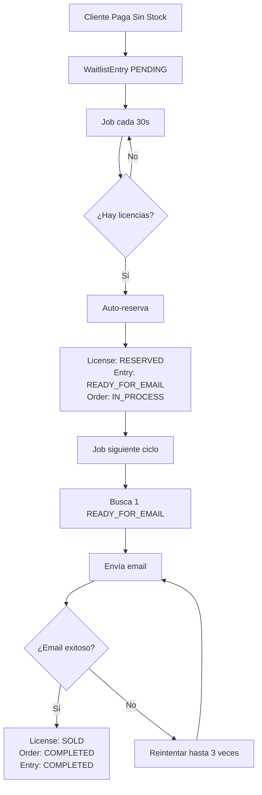

# Sistema de Cola de Correos para Lista de Espera v2.0

## Descripción

El sistema de cola de correos v2.0 implementa un **control de flujo inteligente** que procesa automáticamente la lista de espera con envío secuencial de emails cada 30 segundos. **Las licencias se apartan como RESERVED y las órdenes se completan SOLO después de confirmar el envío exitoso del email**, garantizando integridad transaccional y control de flujo.

## Características Principales v2.0

### 1. 🔄 Procesamiento Automático Inteligente
- **Job cada 30 segundos**: Analiza automáticamente la lista de espera
- **Auto-reserva de licencias**: Aparta licencias como `RESERVED` (no `SOLD`)
- **Envío secuencial**: 1 email cada 30 segundos en orden FIFO
- **Completación confirmada**: Orden `COMPLETED` solo después de email exitoso

### 2. 🔒 Control Transaccional Avanzado
- **SELECT FOR UPDATE**: Prevención de race conditions en inventario
- **Transacciones SERIALIZABLE**: Máxima consistencia de datos
- **Apartado seguro**: Licencias protegidas hasta confirmar entrega
- **Estados precisos**: Refleja la realidad del procesamiento

### 3. 📧 Gestión Inteligente de Email
- **Control de flujo**: Evita saturación del servidor de correos
- **Reintentos automáticos**: Hasta 3 intentos por email fallido
- **Logs completos**: Trazabilidad detallada de cada operación
- **Proveedor Brevo**: Integración robusta con plantillas HTML

## Variables de Entorno

```properties
# Configuración de cola de correos para lista de espera
WAITLIST_EMAIL_INTERVAL_SECONDS=30          # Intervalo entre envíos (segundos)
WAITLIST_EMAIL_MAX_RETRIES=3                # Máximo de reintentos por correo
WAITLIST_EMAIL_QUEUE_MAX_SIZE=1000          # Tamaño máximo de la cola
```

## Flujo de Proceso v2.0 (Implementado)

### 🔄 Nuevo Flujo Automático Inteligente



### 1. Fase de Auto-Reserva (Cada 30s)
```
1. Job analiza lista de espera → Busca entradas PENDING
2. Cuenta licencias disponibles → Verifica stock AVAILABLE  
3. Aparta licencias como RESERVED → No las vende todavía
4. Marca entradas como READY_FOR_EMAIL → Listas para envío
5. Órdenes permanecen IN_PROCESS → Hasta confirmar email
```

### 2. Fase de Envío Controlado (Cada 30s)
```
1. Job busca 1 entrada READY_FOR_EMAIL → Orden FIFO
2. Marca como PROCESSING → Durante envío
3. Envía email via Brevo → Con licencia y detalles
4. ✅ Si email exitoso → Confirma transacción:
   - License: RESERVED → SOLD
   - Order: IN_PROCESS → COMPLETED  
   - Entry: PROCESSING → COMPLETED
5. ❌ Si email falla → Reintenta hasta 3 veces
```

## APIs Administrativas

### Obtener estadísticas de la cola
```http
GET /api/email-queue/stats
Authorization: Bearer <admin_token>
```

**Respuesta:**
```json
{
  "success": true,
  "data": {
    "queueSize": 15,
    "isProcessing": true,
    "intervalSeconds": 30,
    "maxRetries": 3,
    "maxQueueSize": 1000,
    "typeStats": {
      "LICENSE_EMAIL": 12,
      "WAITLIST_NOTIFICATION": 3
    },
    "statusStats": {
      "PENDING": 13,
      "RETRYING": 2
    }
  }
}
```

### Obtener métricas completas
```http
GET /api/email-queue/metrics?productRef=PROD_001
Authorization: Bearer <admin_token>
```

**Respuesta:**
```json
{
  "success": true,
  "data": {
    "waitlist": {
      "total": 45,
      "pending": 20,
      "reserved": 15,
      "processing": 2,
      "completed": 8,
      "failed": 0,
      "productRef": "PROD_001"
    },
    "emailQueue": {
      "queueSize": 15,
      "isProcessing": true,
      "intervalSeconds": 30
    }
  }
}
```

### Limpiar cola (Solo Super Admin)
```http
POST /api/email-queue/clear
Authorization: Bearer <super_admin_token>
```

### Procesar cola manualmente
```http
POST /api/email-queue/process
Authorization: Bearer <admin_token>
```

## Beneficios del Sistema

### 1. Protección del Servidor de Correos
- Evita saturación con envíos masivos
- Respeta límites de rate limiting de proveedores de email
- Reduce probabilidad de ser marcado como spam

### 2. Experiencia de Usuario Mejorada
- Garantiza que todos los usuarios reciban sus licencias
- Mantiene orden justo (FIFO) en la asignación
- Estados de orden precisos y actualizados

### 3. Operación y Monitoreo
- Métricas detalladas para administradores
- Logs completos para debugging
- Controles manuales para casos excepcionales

### 4. Escalabilidad
- Procesamiento asíncrono no bloquea el sistema principal
- Cola en memoria eficiente para volúmenes moderados
- Fácil configuración de parámetros según necesidades

## Consideraciones de Implementación

### 1. Persistencia
- La cola actual es en memoria (se pierde al reiniciar el servidor)
- Para producción considera implementar persistencia en Redis o base de datos

### 2. Monitoreo
- Implementar alertas para cola llena o fallos recurrentes
- Dashboard para visualizar métricas en tiempo real

### 3. Configuración de Producción
```properties
# Configuración conservadora para producción
WAITLIST_EMAIL_INTERVAL_SECONDS=60          # 1 minuto entre envíos
WAITLIST_EMAIL_MAX_RETRIES=5                # Más reintentos
WAITLIST_EMAIL_QUEUE_MAX_SIZE=5000          # Cola más grande
```

## Migración desde Sistema Anterior

El sistema mantiene compatibilidad con el flujo anterior:
- Método `processSingleEntry()` sigue disponible para envío inmediato
- Método `processSingleEntryWithQueue()` nuevo para envío controlado
- Variable `ENABLE_WAITLIST_PROCESSING` controla activación del nuevo sistema
