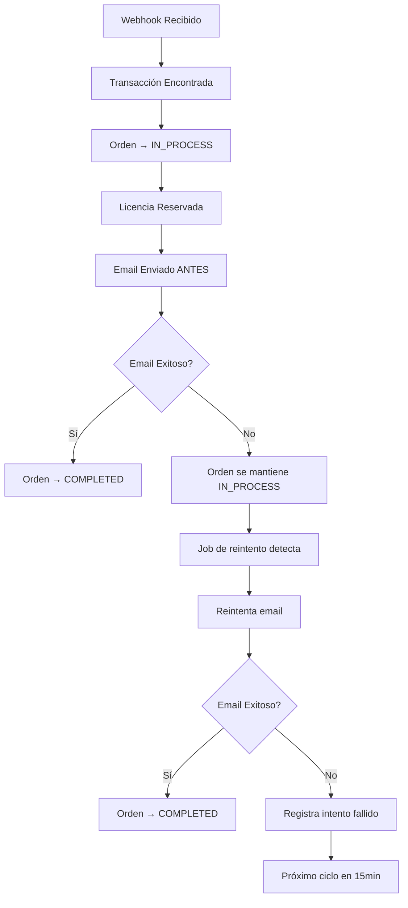
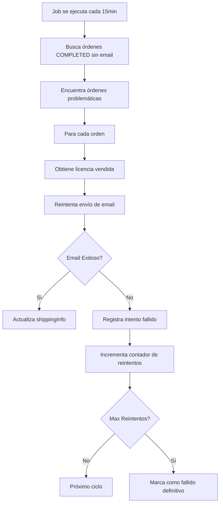

# 📧 Job de Reintento de Emails - Documentación Completa

## 📋 Descripción General

El **Email Retry Job** es un sistema automatizado que resuelve el problema de emails de licencias que fallan durante el procesamiento de pagos. Garantiza que todos los clientes que pagaron reciban su licencia, incluso si el envío inicial del email falla.

## 🎯 Problema Resuelto

### **Situación Anterior (Problemática):**
- ✅ Cliente paga exitosamente
- ✅ Licencia se reserva correctamente
- ✅ Orden se marca como `COMPLETED`
- ❌ **Email falla silenciosamente** (problema de red, proveedor, etc.)
- ❌ **Cliente no recibe licencia** pero la orden aparece como completada

### **Solución Implementada:**
- ✅ Cliente paga exitosamente
- ✅ Licencia se reserva correctamente
- ✅ **Email se envía ANTES** de completar la orden
- ✅ **Orden se completa SOLO** si el email es exitoso
- ✅ **Reintento automático** cada 15 minutos para emails fallidos

## 🏗️ Arquitectura del Sistema

### **Componentes Principales:**

1. **TransactionHandler** (`src/services/webhook/handlers/transactionHandler.js`)
   - Maneja el flujo síncrono de envío de emails
   - Garantiza que la orden se complete solo después del email exitoso

2. **EmailRetryJob** (`src/jobs/emailRetry.js`)
   - Job automatizado que busca órdenes sin email
   - Reintenta el envío de emails fallidos
   - Actualiza el estado de reintentos

3. **JobScheduler** (`src/jobs/scheduler.js`)
   - Ejecuta el job cada 15 minutos
   - Controla la habilitación/deshabilitación del job

4. **Admin API** (`src/routes/admin/jobs.routes.js`)
   - Endpoint para ejecución manual del job
   - Monitoreo y control administrativo

## ⚙️ Configuración

### **Variables de Entorno:**

```bash
# Habilitar reintento automático de emails fallidos
ENABLE_EMAIL_RETRY=true

# Configuración del job (valores por defecto)
# Intervalo de ejecución: 15 minutos
# Máximo de reintentos: 3 por orden
```

### **Configuración del Job:**

```javascript
class EmailRetryJob {
  constructor () {
    this.name = 'emailRetry'
    this.maxRetries = 3
    this.retryIntervalMinutes = 15 // Cada 15 minutos
  }
}
```

## 🔄 Flujo de Funcionamiento

### **1. Procesamiento Normal (Pago Exitoso):**



### **2. Job de Reintento Automático:**



## 📊 Estados y Tracking

### **Estados de Orden:**

- **`IN_PROCESS`**: Pago confirmado, email pendiente o fallido
- **`COMPLETED`**: Pago confirmado + Email enviado exitosamente

### **Información de Email en `shippingInfo`:**

```json
{
  "email": {
    "sent": true,
    "sentAt": "2025-07-30T03:15:30.123Z",
    "messageId": "license-84-1753830930123",
    "recipient": "cliente@email.com",
    "type": "license_delivery"
  }
}
```

### **Información de Reintentos Fallidos:**

```json
{
  "email": {
    "sent": false,
    "attemptedAt": "2025-07-30T03:15:30.123Z",
    "error": "Connection timeout",
    "recipient": "cliente@email.com",
    "type": "license_delivery",
    "retryAttempt": 2
  }
}
```

## 🛠️ Uso y Administración

### **1. Ejecución Automática:**

El job se ejecuta automáticamente cada 15 minutos si está habilitado:

```bash
# Habilitar ejecución automática
ENABLE_EMAIL_RETRY=true
```

### **2. Ejecución Manual:**

#### **Endpoint de Administración:**
```bash
POST /api/admin/jobs/email-retry/run
Authorization: Bearer <SUPER_ADMIN_TOKEN>
```

#### **Ejemplo de Uso:**
```bash
# Obtener token de administrador
curl -X POST http://localhost:3000/api/auth/login \
  -H "Content-Type: application/json" \
  -d '{
    "email": "superadmin@innovatelearning.com.co",
    "password": "Innovate@202025"
  }'

# Ejecutar job manualmente
curl -X POST http://localhost:3000/api/admin/jobs/email-retry/run \
  -H "Authorization: Bearer <TOKEN_OBTENIDO>"
```

#### **Respuesta del Job:**
```json
{
  "success": true,
  "message": "Job de reintento de emails ejecutado exitosamente",
  "data": {
    "processed": 2,
    "success": 1,
    "total": 2,
    "errors": [
      {
        "orderId": 84,
        "error": "Connection timeout"
      }
    ]
  }
}
```

### **3. Monitoreo del Job:**

#### **Ver Estado del Scheduler:**
```bash
GET /api/admin/jobs/status
Authorization: Bearer <SUPER_ADMIN_TOKEN>
```

#### **Respuesta:**
```json
{
  "success": true,
  "data": {
    "scheduler": {
      "running": true,
      "jobs": {
        "emailRetry": {
          "name": "emailRetry",
          "running": true,
          "interval": 900000
        }
      }
    }
  }
}
```

## 📈 Métricas y Logs

### **Logs de Negocio:**

```javascript
// Inicio del job
logger.logBusiness('job:emailRetry.start', {
  maxRetries: 3,
  retryIntervalMinutes: 15
})

// Procesamiento de orden
logger.logBusiness('emailRetry:processing', {
  orderId: 84,
  customerEmail: 'cliente@email.com',
  productRef: '9789702651154'
})

// Email exitoso
logger.logBusiness('emailRetry:success', {
  orderId: 84,
  customerEmail: 'cliente@email.com',
  licenseId: 262
})

// Completado del job
logger.logBusiness('job:emailRetry.completed', {
  totalOrders: 2,
  processed: 2,
  success: 1,
  errors: 1
})
```

### **Logs de Error:**

```javascript
logger.logError(error, {
  operation: 'emailRetry.retryEmail',
  orderId: 84,
  customerEmail: 'cliente@email.com'
})
```

## 🔍 Diagnóstico y Troubleshooting

### **1. Verificar Órdenes Problemáticas:**

```sql
-- Buscar órdenes completadas sin información de email
SELECT o.id, o.status, o.shipping_info, o.created_at, o.updated_at
FROM orders o
WHERE o.status = 'COMPLETED' 
  AND o.shipping_info IS NULL;

-- Buscar órdenes con emails fallidos
SELECT o.id, o.status, o.shipping_info, o.created_at, o.updated_at
FROM orders o
WHERE o.status = 'COMPLETED' 
  AND o.shipping_info->>'email'->>'sent' = 'false';
```

### **2. Verificar Licencias Vendidas:**

```sql
-- Buscar licencias vendidas para órdenes sin email
SELECT l.id, l.product_ref, l.license_key, l.status, l.order_id, l.sold_at
FROM licenses l
JOIN orders o ON l.order_id = o.id
WHERE l.status = 'SOLD' 
  AND o.shipping_info IS NULL;
```

### **3. Problemas Comunes:**

#### **Job no se ejecuta:**
- Verificar `ENABLE_EMAIL_RETRY=true`
- Revisar logs del scheduler
- Verificar que el job esté registrado

#### **Emails siguen fallando:**
- Verificar configuración de Brevo
- Revisar `BREVO_API_KEY`
- Verificar límites de rate limiting

#### **Órdenes no se completan:**
- Verificar que las licencias estén vendidas
- Revisar logs de `sendLicenseEmail`
- Verificar configuración de templates

## 🚀 Casos de Uso

### **1. Recuperación de Emails Fallidos:**

El job automáticamente detecta y reintenta emails que fallaron durante el procesamiento normal.

### **2. Mantenimiento del Sistema:**

Durante mantenimientos, los emails pueden fallar temporalmente. El job recupera automáticamente estos casos.

### **3. Problemas de Proveedor:**

Si Brevo tiene problemas temporales, el job reintenta automáticamente cuando el servicio se restaura.

### **4. Auditoría y Compliance:**

El sistema mantiene un registro completo de todos los intentos de envío para auditoría.

## 🔒 Seguridad y Consideraciones

### **Seguridad:**
- ✅ Solo usuarios que pagaron reciben licencias
- ✅ Emails se envían solo después de confirmar pago
- ✅ Acceso administrativo restringido a SUPER_ADMIN
- ✅ Logs completos para auditoría

### **Performance:**
- ✅ Job se ejecuta cada 15 minutos (no sobrecarga el sistema)
- ✅ Procesamiento secuencial (evita rate limiting)
- ✅ Timeout configurado para evitar bloqueos

### **Mantenimiento:**
- ✅ Variables de entorno para control
- ✅ Logs detallados para diagnóstico
- ✅ Endpoints de administración para control manual

## 📝 Notas de Implementación

### **Cambios Realizados:**

1. **TransactionHandler**: Flujo síncrono de envío de emails
2. **EmailRetryJob**: Job automatizado de reintento
3. **JobScheduler**: Integración del nuevo job
4. **Admin API**: Endpoint para ejecución manual

### **Compatibilidad:**
- ✅ No altera la estructura existente del sistema
- ✅ Mantiene todas las funcionalidades actuales
- ✅ Sigue las convenciones del proyecto
- ✅ Compatible con el sistema de roles existente

### **Escalabilidad:**
- ✅ Configurable por variables de entorno
- ✅ Intervalos ajustables
- ✅ Límites de reintentos configurables
- ✅ Monitoreo y métricas integrados

---

**Última actualización:** 30 de Julio, 2025  
**Versión:** 1.0  
**Autor:** Sistema de Pagos Innovate Learning 