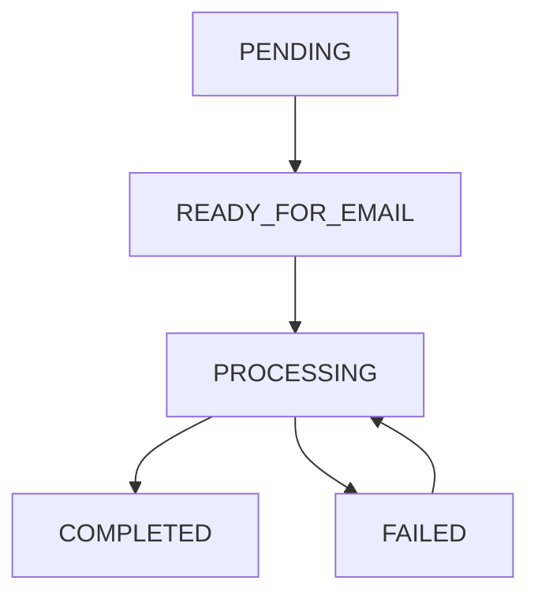

# 📋 Servicio de Lista de Espera - Guía del Super Usuario

## 🎯 Descripción General

El **Servicio de Lista de Espera** es un sistema inteligente que maneja automáticamente las órdenes de productos digitales cuando no hay licencias disponibles en el inventario. En lugar de rechazar la venta, el sistema:

1. **Acepta el pago** del cliente
2. **Agrega la orden** a una lista de espera
3. **Notifica al cliente** sobre el estado
4. **Procesa automáticamente** cuando hay licencias disponibles

## 🚀 Beneficios del Sistema

### **Para el Negocio**
- ✅ **No se pierden ventas** por falta de stock
- ✅ **Ingresos garantizados** desde el momento del pago
- ✅ **Gestión automática** sin intervención manual
- ✅ **Trazabilidad completa** de todas las operaciones

### **Para el Cliente**
- ✅ **Experiencia fluida** sin errores de pago
- ✅ **Comunicación clara** sobre el estado
- ✅ **Entrega automática** cuando hay stock
- ✅ **Transparencia** en el proceso

## 🔄 Flujo de Funcionamiento

### **Escenario 1: Cliente Compra Sin Stock Disponible**
```
1. Cliente paga → Pago exitoso
2. Sistema verifica stock → No hay licencias disponibles
3. Sistema agrega a lista de espera → Estado: PENDING
4. Sistema envía email → "Tu compra está en lista de espera"
5. Orden queda en IN_PROCESS → Esperando licencias
```

### **Escenario 2: Sistema Procesa Automáticamente (Mejorado)**
```
1. Job automático analiza → Cada 30 segundos
2. Detecta licencias disponibles → Licencias AVAILABLE
3. Aparta licencias como RESERVED → Estado: RESERVED (no SOLD)
4. Marca entradas como READY_FOR_EMAIL → Listas para envío
5. Órdenes permanecen IN_PROCESS → Hasta confirmar email
6. Envía 1 email cada 30 segundos → Control de flujo
7. Solo después de email exitoso → Licencia SOLD + Orden COMPLETED
```

## 📊 Estados del Sistema

### **Estados de Lista de Espera (Actualizados)**
| Estado | Descripción | Acción Requerida | Siguiente Estado |
|--------|-------------|------------------|------------------|
| `PENDING` | En lista de espera | Esperar licencias disponibles | `READY_FOR_EMAIL` |
| `RESERVED` | ⚠️ DEPRECATED | Ya no se usa | - |
| `READY_FOR_EMAIL` | 🆕 Licencia apartada, lista para email | Procesamiento automático | `PROCESSING` |
| `PROCESSING` | Enviando licencia | Esperar completación | `COMPLETED` |
| `COMPLETED` | Licencia entregada y orden completada | ✅ Finalizado | - |
| `FAILED` | Error en procesamiento | Revisar y reintentar | - |

### **Estados de Licencias**
| Estado | Descripción | Uso | Cuando Ocurre |
|--------|-------------|-----|---------------|
| `AVAILABLE` | Disponible para venta | Stock normal | Licencia en inventario |
| `RESERVED` | Apartada para lista de espera | 🆕 Apartada pero no vendida | Después de auto-reserva |
| `SOLD` | Vendida y asignada | Cliente activo | ✅ Solo después de email exitoso |
| `ANNULLED` | Anulada por admin | No disponible | Acción administrativa |
| `RETURNED` | Devuelta al stock | Disponible nuevamente | Devolución de cliente |

## 🛠️ Endpoints de Administración

### **1. Consultar Métricas**
```http
GET /api/waitlist/metrics?productRef=SOFT-PRO-1Y
```

**Respuesta (Actualizada):**
```json
{
  "success": true,
  "data": {
    "waitlist": {
      "total": 15,
      "pending": 5,
      "reserved": 0,
      "processing": 1,
      "readyForEmail": 3,
      "completed": 6,
      "failed": 0,
      "productRef": "SOFT-PRO-1Y"
    },
    "emailQueue": {
      "queueSize": 2,
      "isProcessing": true,
      "intervalSeconds": 30
    }
  }
}
```

**Uso:** Monitorear el estado general de la lista de espera por producto.

### **2. Ver Lista de Espera**
```http
GET /api/waitlist?status=PENDING&productRef=SOFT-PRO-1Y
```

**Parámetros:**
- `status`: PENDING, RESERVED, PROCESSING, COMPLETED, FAILED
- `productRef`: Referencia del producto
- `customerId`: ID del cliente (opcional)

**Respuesta:**
```json
{
  "success": true,
  "data": [
    {
      "id": 1,
      "orderId": 123,
      "customerId": 456,
      "productRef": "SOFT-PRO-1Y",
      "qty": 1,
      "status": "PENDING",
      "priority": "2024-01-15T10:30:00.000Z",
      "createdAt": "2024-01-15T10:30:00.000Z",
      "order": {
        "id": 123,
        "grandTotal": 29900,
        "customer": {
          "firstName": "Juan",
          "lastName": "Pérez",
          "email": "juan@email.com"
        }
      }
    }
  ],
  "count": 1
}
```

### **3. Reservar Licencias Disponibles**
```http
POST /api/waitlist/reserve
Content-Type: application/json
Authorization: Bearer <token>

{
  "productRef": "SOFT-PRO-1Y"
}
```

**Respuesta:**
```json
{
  "success": true,
  "data": {
    "reserved": 5,
    "waitlistCount": 8,
    "availableLicenses": 10,
    "reservations": [
      {
        "licenseId": 101,
        "waitlistEntryId": 1,
        "orderId": 123
      }
    ],
    "message": "Reserved 5 licenses for waitlist"
  }
}
```

**Uso:** Reservar licencias disponibles para usuarios en lista de espera. El sistema procesa automáticamente después.

### **4. Procesar Manualmente**
```http
POST /api/waitlist/process
Authorization: Bearer <token>
```

**Respuesta:**
```json
{
  "success": true,
  "data": {
    "processed": 3,
    "failed": 0,
    "errors": []
  },
  "message": "Processed 3 entries, 0 failed"
}
```

**Uso:** Ejecutar procesamiento manual (normalmente no es necesario, el job automático lo hace).

### **5. Remover de Lista de Espera**
```http
DELETE /api/waitlist/1
Content-Type: application/json
Authorization: Bearer <token>

{
  "reason": "CUSTOMER_REQUEST"
}
```

**Respuesta:**
```json
{
  "success": true,
  "data": {
    "success": true,
    "message": "Entry removed from waitlist"
  },
  "message": "Entry removed from waitlist successfully"
}
```

**Uso:** Remover entrada de la lista de espera (con reembolso manual si es necesario).

### **6. Estado del Job Automático**
```http
GET /api/waitlist/job/status
Authorization: Bearer <token>
```

**Respuesta:**
```json
{
  "success": true,
  "data": {
    "name": "waitlistProcessing",
    "isRunning": false,
    "lastRun": "2024-01-15T10:35:00.000Z",
    "nextRun": "2024-01-15T10:35:30.000Z"
  }
}
```

### **7. Ejecutar Job Manualmente**
```http
POST /api/waitlist/job/run
Authorization: Bearer <token>
```

**Uso:** Ejecutar el job de procesamiento manualmente (para testing o emergencias).

## 📧 Emails Automáticos

### **Email de Lista de Espera**
Cuando un cliente paga sin stock disponible:
```
Asunto: Tu compra está en lista de espera - [Producto]

¡Hola [Nombre]!

Tu pago ha sido procesado exitosamente, pero actualmente no tenemos 
licencias disponibles para [Producto].

📋 ESTADO DE TU ORDEN:
• Orden: #[ID]
• Producto: [Producto]
• Estado: En lista de espera
• Tiempo estimado: 24-48 horas

⏰ ¿QUÉ PASA AHORA?
Te hemos agregado a nuestra lista de espera y procesaremos tu licencia 
tan pronto como tengamos stock disponible.

¡Gracias por tu paciencia!
```

### **Email de Licencia Enviada**
Cuando se procesa la licencia:
```
Asunto: Tu licencia para [Producto] está lista

¡Hola [Nombre]!

¡Tu compra ha sido procesada exitosamente!

📋 DETALLES DE TU LICENCIA:
• Producto: [Producto]
• Clave de Licencia: [LICENSE-KEY]
• Orden: #[ID]
• Fecha de compra: [Fecha]

🔧 INSTRUCCIONES DE ACTIVACIÓN:
[Instrucciones específicas del producto]
```

## 🔧 Configuración del Sistema

### **Variables de Entorno**
```bash
# Tiempo de procesamiento del job (30 segundos)
# Configurado en src/jobs/waitlistProcessing.js

# Email de soporte
EMAIL_FROM=noreply@innovatelearning.com.co

# Tiempo estimado de entrega (configurable en email template)
ESTIMATED_DELIVERY_TIME=24-48 horas
```

### **Job Automático**
- **Frecuencia:** Cada 30 segundos
- **Función:** Procesar licencias reservadas
- **Estado:** Monitoreado automáticamente
- **Logs:** Completos para debugging

## 📈 Monitoreo y Métricas

### **Métricas Clave a Monitorear**
1. **Total en lista de espera** - Volumen de demanda
2. **Tiempo promedio de espera** - Calidad del servicio
3. **Tasa de conversión** - Efectividad del sistema
4. **Errores de procesamiento** - Estabilidad del sistema

### **Logs Importantes**
```bash
# Buscar logs de lista de espera
grep "waitlist:" logs/app.log

# Buscar logs de procesamiento
grep "job:waitlistProcessing" logs/app.log

# Buscar errores
grep "ERROR.*waitlist" logs/app.log
```

## 🚨 Casos de Uso Especiales

### **1. Stock Agotado Completamente**
```
Situación: No hay licencias disponibles para ningún producto
Acción: 
- Monitorear métricas de lista de espera
- Importar nuevas licencias cuando sea posible
- Comunicar a clientes sobre demoras
```

### **2. Errores de Procesamiento**
```
Situación: Entradas en estado FAILED
Acción:
- Revisar logs de errores
- Ejecutar procesamiento manual
- Contactar al cliente si es necesario
```

### **3. Reembolsos**
```
Situación: Cliente solicita reembolso
Acción:
- Remover de lista de espera
- Procesar reembolso manual
- Liberar licencia si estaba reservada
```

## ⚡ Comandos Rápidos

### **Verificar Estado del Sistema**
```bash
# Métricas generales
curl -H "Authorization: Bearer <token>" \
  "http://localhost:3000/api/waitlist/metrics"

# Estado del job
curl -H "Authorization: Bearer <token>" \
  "http://localhost:3000/api/waitlist/job/status"
```

### **Procesar Lista de Espera**
```bash
# Reservar licencias
curl -X POST -H "Authorization: Bearer <token>" \
  -H "Content-Type: application/json" \
  -d '{"productRef":"SOFT-PRO-1Y"}' \
  "http://localhost:3000/api/waitlist/reserve"

# Ejecutar procesamiento manual
curl -X POST -H "Authorization: Bearer <token>" \
  "http://localhost:3000/api/waitlist/job/run"
```

## 🎯 Mejores Prácticas

### **1. Monitoreo Regular**
- Revisar métricas diariamente
- Verificar estado del job automático
- Monitorear logs de errores

### **2. Gestión de Stock**
- Mantener inventario actualizado
- Reservar licencias cuando sea necesario
- Comunicar demoras a clientes

### **3. Comunicación**
- Responder consultas de clientes rápidamente
- Proporcionar estimaciones realistas
- Mantener transparencia en el proceso

### **4. Mantenimiento**
- Revisar entradas fallidas regularmente
- Limpiar entradas antiguas si es necesario
- Actualizar estimaciones de tiempo según demanda

## 🔍 Troubleshooting

### **Problema: Job no procesa entradas**
```bash
# Verificar estado del job
GET /api/waitlist/job/status

# Ejecutar manualmente
POST /api/waitlist/job/run

# Revisar logs
grep "waitlistProcessing" logs/app.log
```

### **Problema: Licencias no se reservan**
```bash
# Verificar disponibilidad
SELECT COUNT(*) FROM licenses WHERE status = 'AVAILABLE' AND product_ref = 'SOFT-PRO-1Y';

# Verificar lista de espera
GET /api/waitlist?status=PENDING&productRef=SOFT-PRO-1Y
```

### **Problema: Emails no se envían**
```bash
# Verificar configuración de email
echo $EMAIL_FROM

# Revisar logs de email
grep "email:" logs/app.log
```

## 📞 Soporte

Para problemas técnicos o consultas sobre el sistema de lista de espera:

- **Email:** soporte@innovatelearning.com.co
- **Documentación:** Esta guía y código fuente
- **Logs:** `logs/app.log` para debugging

---

## 🚀 Flujo Mejorado v2.0 (Implementado)

### **Características del Nuevo Sistema**

#### **🔄 Procesamiento Automático Inteligente**
1. **Análisis cada 30 segundos**: Job automático revisa lista de espera
2. **Apartado de licencias**: Se marcan como `RESERVED` (no `SOLD`)  
3. **Órdenes en proceso**: Permanecen `IN_PROCESS` hasta confirmar email
4. **Envío controlado**: 1 email cada 30 segundos en orden FIFO
5. **Completación confirmada**: Solo después de email exitoso

#### **📊 Estados Mejorados**


#### **🔒 Garantías Transaccionales**
- **SELECT FOR UPDATE**: Prevención de race conditions
- **Transacciones SERIALIZABLE**: Máxima consistencia
- **Rollback automático**: En caso de errores
- **Locks de inventario**: Protección contra concurrencia

#### **📧 Control de Email Optimizado**
- **Intervalo fijo**: 30 segundos entre emails
- **Orden FIFO**: Primer llegado, primer enviado
- **Reintentos automáticos**: Hasta 3 intentos por email
- **Confirmación requerida**: Orden solo se completa después de email

### **Ventajas del Sistema v2.0**

#### **✅ Para el Negocio**
- **Apartado != Venta**: Licencias protegidas hasta confirmar entrega
- **Control de flujo**: No saturar servidor de correos
- **Trazabilidad completa**: Logs detallados de cada paso
- **Recuperación automática**: Sistema resiliente a fallos

#### **✅ Para el Cliente**  
- **Entrega garantizada**: Email confirmado = orden completada
- **Orden justo**: FIFO respeta orden de llegada
- **Estado preciso**: Refleja realidad del procesamiento
- **Comunicación clara**: Notificaciones en cada etapa

#### **✅ Para Operaciones**
- **Monitoreo avanzado**: Métricas de waitlist + email queue
- **Control manual**: APIs para intervención cuando necesario
- **Debugging mejorado**: Logs detallados por operación
- **Configuración flexible**: Variables de entorno ajustables

---

**Versión:** 2.0  
**Última actualización:** Julio 2025  
**Mantenedores:** Equipo Innovate Learning  
**Estado:** ✅ Implementado y funcionando 